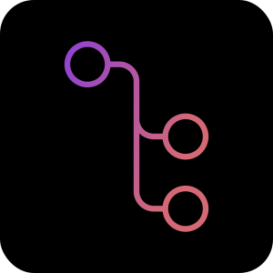

<div align="center">
  
  <h1>git-tree</h1>

  <p><i>Terminal-style git branch visualizer — built with Rust + Dioxus</i></p>

  <p>
   
   
   
   
   <br> 
   
   
      
   
   <br>
    
   
   
  </p>
</div>

---

## What is it?

git-tree lets you visualize your git history in a clean terminal-style desktop app. Open any local repo or clone a remote one, click any commit node to see author, date, message, and diff stats. Full diff viewer included.

```
 ──●──●──●──●──●──●──●──
        ╲       ╱
         ●─────●
```

---

## Features (v0.2)

- Open local git repos or clone remote URLs
- Horizontal **and** vertical branch tree layouts
- Each contributor gets a unique persistent color
- Click any commit node → author, date, message, hash, diff stats
- Full diff viewer with per-file collapse/expand and hunk lines
- Search commits by author, message, or hash
- Keyboard navigation between commits (← → or ↑ ↓)
- Zoom + pan (CTRL+scroll, drag, or toolbar buttons)
- Recent repositories list with search filter
- Copy commit hash to clipboard
- 11 built-in themes with live preview in settings
- CRT scanline overlay (toggleable)
- Font size control (11–16px)
- Node spacing control (Compact / Normal / Wide)
- Merge commit visibility toggle
- Default theme: **Terminal** (black + purple, Space Mono font)

---

## Install

### Linux (recommended)

**1. Install system dependencies**

Ubuntu / Debian:
```bash
sudo apt update
sudo apt install -y \
  libgit2-dev \
  libwebkit2gtk-4.1-dev \
  libgtk-3-dev \
  libglib2.0-dev \
  libcairo2-dev \
  libpango1.0-dev \
  libxdo-dev \
  pkg-config
```

Arch Linux:
```bash
sudo pacman -S libgit2 webkit2gtk-4.1 gtk3 base-devel
```

Fedora:
```bash
sudo dnf install libgit2-devel webkit2gtk4.1-devel gtk3-devel
```

**2. Download the binary**

Grab the latest release from the [Releases page](https://github.com/MahiroJV/git-tree/releases/latest):

```bash
wget https://github.com/MahiroJV/git-tree/releases/latest/download/git-tree-linux
chmod +x git-tree-linux
./git-tree-linux
```

Or move it to your PATH for system-wide access:
```bash
sudo mv git-tree-linux /usr/local/bin/git-tree
git-tree
```

---

## Build from source

**Requirements:**
- Rust 1.75+
- Dioxus CLI
- System dependencies (see above)

```bash
# Clone the repo
git clone https://github.com/MahiroJV/git-tree
cd git-tree

# Install Dioxus CLI
cargo install dioxus-cli

# Run in dev mode
dx serve --platform desktop

# Build release binary
dx build --platform desktop --release
# Binary will be at: dist/git-tree
```

---

## Usage

**Open a local repo:**
1. Launch git-tree
2. Make sure `[ LOCAL FOLDER ]` tab is selected
3. Type the full path to your repo or use the 📁 picker
4. Click `OPEN →`

**Clone a remote repo:**
1. Click `[ REMOTE URL ]` tab
2. Paste a GitHub/GitLab URL (e.g. `https://github.com/user/repo`)
3. Click `CLONE →`
4. git-tree clones it to a temp folder and opens it

**Navigating the tree:**
- Click any commit node → left panel shows commit info, right panel shows diff stats
- `← →` (horizontal) or `↑ ↓` (vertical) to move between commits
- `ESC` to deselect
- `CTRL+scroll` to zoom, drag to pan
- Toolbar → `[ VIEW DIFF ]` to open the full diff viewer

**Settings:**
- 11 themes with live preview
- Font size, node spacing, merge commit visibility
- Tree direction (Horizontal / Vertical)
- CRT scanline overlay

---

## Themes

| Name | Description |
|---|---|
| **Terminal** | Black + purple — default |
| **Matrix** | Hacker green |
| **Amber** | Old phosphor monitor |
| **Synthwave** | 80s retrowave |
| **Nord** | Cold Nordic blues |
| **Dracula** | Popular dark dev theme |
| **Gruvbox** | Warm retro |
| **Blood Moon** | Dark dramatic red |
| **Ice Terminal** | Cold blue cyberpunk |
| **Light** | Paper white, clean |
| **Dark** | Deeper black than Terminal |

---

## 🚀 Roadmap

---

### 🧱 v0.1 — Foundation ✅
- [x] Tree visualization
- [x] Click panels (commit info + diff stats)
- [x] 9 themes
- [x] Contributor colors
- [x] Local + remote clone
- [x] Zoom + pan
- [x] App icon

---

### 🧪 v0.2 — Usability ✅
- [x] Search by author / message / hash
- [x] Diff viewer (actual +/- code lines with collapse)
- [x] Keyboard navigation (arrow keys between commits)
- [x] Fix font loading (Space Mono offline)
- [x] Recent repositories list with filter
- [x] Copy hash button
- [x] Vertical tree layout
- [x] Settings panel (font size, node spacing, merge visibility)
- [x] CRT scanline overlay
- [x] 2 extra themes (Light, Dark)

---

### 🎨 v0.3 — Polish
- [ ] Minimap (corner overview of the full tree)
- [ ] Repo stats (contributor leaderboard + commit heatmap)
- [ ] Export tree as SVG or PNG
- [x] Open commit in browser (GitHub / GitLab)
- [x] Node pulse animation on click
- [x] Blame view (per-file line authorship)

---

### 🖥️ v0.4 — Platform
- [ ] GitHub OAuth login
- [ ] Private repo access
- [ ] Windows + macOS builds (CI)
- [ ] Linux AppImage packaging

---

### 🏁 v1.0 — Release
- [ ] Android port (Dioxus mobile)
- [ ] Full keyboard shortcut system
- [ ] Performance improvements (lazy loading for huge repos)
- [ ] Community themes

---

## Project Structure

```
src/
├── main.rs                 # Entry point, window config
├── app.rs                  # Root component + global state
├── theme.rs                # 11 themes + contributor color engine
├── recent.rs               # Recent repos persistence (~/.config/git-tree/)
├── components/
│   ├── home_screen.rs      # Repo open/clone screen + recent list
│   ├── toolbar.rs          # Top navigation + search bar
│   ├── tree_canvas.rs      # SVG tree (horizontal + vertical layouts)
│   ├── left_panel.rs       # Commit details + copy hash
│   ├── right_panel.rs      # Diff stats + file list
│   ├── diff_viewer.rs      # Full diff viewer with per-file collapse
│   └── settings.rs         # Theme selector + display options
└── git/
    ├── loader.rs           # Open local / clone remote
    └── parser.rs           # Git history → tree data structures

assets/
├── css/
│   ├── style.css           # Core terminal theme + layout
│   ├── diff_viewer.css     # Diff viewer styles
│   ├── left_panel.css      # Left panel styles
│   ├── right_panel.css     # Right panel styles
│   └── panel_shared.css    # Shared collapse/expand styles
└── fonts/
    ├── Oxanium.ttf
    └── SpaceMono-Regular.woff2
```

---

## Requirements

| Dependency | Version |
|---|---|
| Rust | 1.75+ |
| Dioxus | 0.6 |
| git2 | 0.19 |
| libgit2 | system |
| webkit2gtk | 4.1 (Linux) |

---

## Author

**MahiroJV** — [github.com/MahiroJV](https://github.com/MahiroJV)

Built with Rust + Dioxus 🦀

---

## License

MIT
